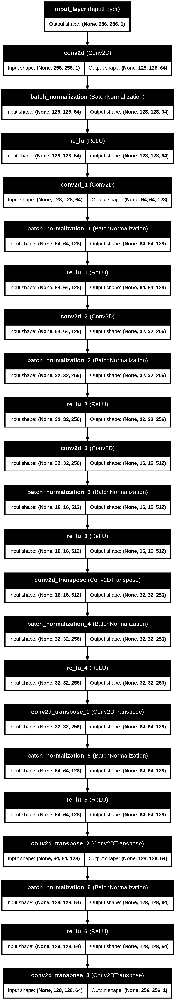
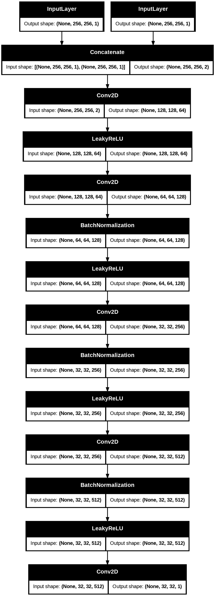

# AESS-challenge-ENSI-SB : Oil Spill Detection and Monitoring

### **Overview** :
This project leverages satellite SAR images from the Copernicus dataset and a SegNet deep learning model to detect oil spills, calculate their size and surface area. It also includes a web platform as a prototype for visualizing and alerting response teams about oil spill incidents.


## Table of content :
1. [Features](#features-)
2. [Architecture](#architecture)
3. [Getting Started](#getting-started)
4. [Usage](#usage-)
5. Model Details
6. Web Platform

## Features :  
This project aims to address the environmental challenge of oil spills by combining AI and a web platform:  
- **AI Model**:  
  - Detect oil spills from Copernicus SAR images using a deep learning SegNet model by generating Ground Truth Masks (GTM)
  - Calculate the size and surface area of detected spills.    
- **Web Platform**:  
  - Display detected oil spills on an interactive map.  
  - Send real-time alerts to response teams.  
  - Maintain a history of past oil spills for analysis.  

## **Architecture**  
The project consists of two main parts:  

### **1. AI Model**  
- **Dataset**: European Space Agency (ESA) via the Copernicus Open Access Hub SAR image data.  
- **Model**: SegNet-based deep learning architecture for semantic segmentation.  
- **Output**: Ground truth masks for oil spills, spill size, and surface area calculations.  

### **2. Web Platform**  
- **Frontend**: Built with React.js for user interaction.


## **Getting Started** 
### **Installation Steps**  
1. Clone the repository:  
    ```bash
   git clone https://github.com/AhmedTrb/AESS-challenge-ENSI-SB.git
   cd AESS-challenge-ENSI-SB
2. Set up the environment for the AI model:
    ``` bash
    pip install -r requirements.txt
3. Set up the web platform:
    ```bash
    cd web-platform
    npm install
## **Usage :**
  1. Running the AI model :
  - Importing necessary libraries.
  - Loading and processing data.
  - Splitting the dataset.
  - Loading pretrained model weights.
  - Testing the model and displaying predictions.
  2. Running the web platform :
     
    cd web-platform
    npm run dev
  Open the platform in your browser at http://localhost:3000

## **Model Details :**
### 1. Seg-Net Generator : 
The generator is a Convolutional Neural Network (CNN) that consists of an encoder-decoder structure to process the input images and generate segmentation masks.
  - **Encoder:** Uses convolutional layers with down-sampling to extract features.
  - **Decoder:** Uses transposed convolutional layers to reconstruct the segmentation masks.


### 2. Patch-GAN Discriminator :
The discriminator evaluates whether a given pair of input image and generated mask is real or fake.

  

### Dataset : 
The dataset consists of preprocessed raw images and Ground Truth Masks (GTM). It was collected from the Sentinel-1 mission satellite, which provides level-1 Ground Range Detected (GRD) data, equipped with a C-band Synthetic Aperture Radar (SAR) system and provided from this paper [[1]](#1). 
 - **Raw Images:** Contains the original SAR images.
 - **Ground Truth Masks (GTM):** Corresponding binary masks indicating the oil spill regions.

## References :
<a id="1">[1]</a> Deep neural network for oil spill detection using Sentinel-1 data: application to Egyptian coastal regions by Samira Ahmed,Tamer ElGharbawi,Mahmoud Salah & Mahmoud El-Mewafi [link](https://www.tandfonline.com/doi/full/10.1080/19475705.2022.2155998#abstract)

<a id="2">[2]</a> Mapping oil pollution in the Gulf of Suez in 2017–2021 using Synthetic Aperture Radar [link](https://www.sciencedirect.com/science/article/pii/S1110982323000704#s0010)

